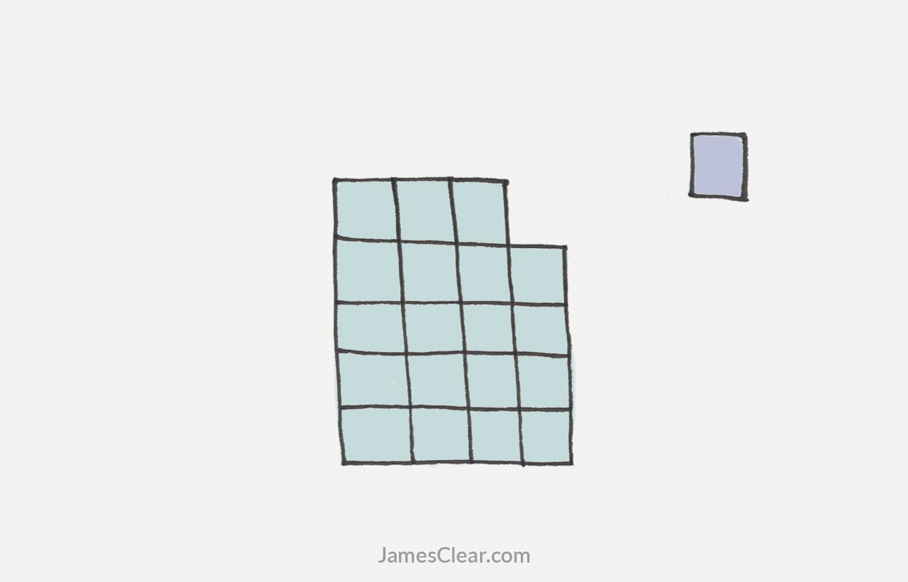

# Ways to get more things done

Let's define productivity. Productivity is a measure of efficiency of a person completing a task. We often assume that productivity means getting more things done each day. Wrong. Productivity is getting important things done consistently. And no matter what you are working on, there are only a few things that are truly important. Being productive is about maintaining a steady, average speed on a few things, not maximum speed on everything.

## Warren Buffett’s “2 List” Strategy for Focused Attention
Buffett uses a simple 3-step productivity strategy to help his employees determine their priorities and actions. You may find this method useful for making decisions and getting yourself to commit to doing one thing right away

**Step 1:** Write down your top `25 career goals`. Or you could also complete this exercise with goals for a shorter timeline. For example, write down the top 25 things you want to `accomplish this week`.

**Step 2:** Review this list and circle top **5 goals**

**Step 3:** Start working on top 5 goals right away. Everything in 20 things that you didn't circle just became your avoid-At-All-Cost list. 

No matter what, these things get no attention from you until you’ve succeeded with your top 5

## Ivy Lee's simple method for achieving peak productivity:

1. At the end of each work day, write down the six most important things you need to accomplish tomorrow. Do not write down more than six tasks.
2. Prioritize those six items in order of their true importance.
3. When you arrive tomorrow, concentrate only on the first task. Work until the first task is finished before moving on to the second task.
4. Approach the rest of your list in the same fashion. At the end of the day, move any unfinished items to a new list of six tasks for the following day.
5. Repeat this process every working day.

## The Eisenhower Box: How to be More Productive
Using the decision matrix for taking action and organizing your tasks.

1. Urgent and important (tasks you will do immediately).
2. Important, but not urgent (tasks you will schedule to do later).
3. Urgent, but not important (tasks you will delegate to someone else).
4. Neither urgent nor important (tasks that you will eliminate).

**Something more**
- Technically, we are capable of doing 2 things at the same time.
- What's imposible? is concerntrating on two tasks at once. During any single instant, you are concertrating on one or the other.
- Most people don’t have trouble with focusing. They have trouble with deciding.
- Most healthy humans have a brain that is capable of focusing if we get the distractions out of the way. 

Have you ever had a task that you absolutely had to get done? What happened? You got it done because the deadline made the decision for you. Maybe you procrastinated beforehand, but once things became urgent and you were forced to make a decision, you took action.

- It doesn’t matter how long your goal will take, just get started.
- Turning the temperature down or moving to a cooler place is an easy way to focus your mind and body.

### Reference:
1. http://jamesclear.com/ivy-lee
2. http://jamesclear.com/focus
3. http://jamesclear.com/eisenhower-box