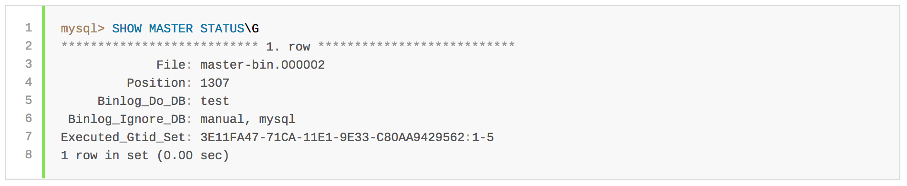

# The MySQL Binary Log
**The binary log** contains `events` that describe `database changes` such as table creation operations or changes to table data. It also contains events for statements that **potentially could have made changes** (for example, a DELETE which matched no rows), unless row-based logging is used. The binary log also contains information about `how long each statement` took that **updated data**.



## The binary log has two important purposes:
1. For replication, the binary log on a master replication server provides a record of the data changes to be sent to slave servers.
   The master server sends the events contained in its binary log to its slaves, 
   which `execute` those events to make the `same data changes` that were made on the master

2. Certain `data recovery operations` require use of the binary log. After a backup has been restored, 
   the events in the binary log that were recorded after the backup was made are re-executed.
   These events bring databases up to date from the point of the backup

**Note:** 
+ The binary log is `not used` for statements such as `SELECT` or `SHOW` that do `not modify data`. 
+ To log all statements (for example, to identify a problem query), use the `general query log`
+ Running a server with binary logging enabled makes performance slightly slower. 
+ However, the benefits of the binary log in enabling you to set up replication and for restore operations generally outweigh this minor performance decrement.
+ The binary log is generally resilient to unexpected halts because only complete transactions are logged or read back
+ Slave server in replication  by default does not write to its own binary log any data modifications that are received from the replication master. 
But sometime we want to log these modifications, slave can do that. This is done when a slave is also to `act as a master` to `other slaves` in chained replication. 

## Binary log files
- **mysqld** appends a numeric extension to the binary log base name to generate binlog file names.
  The number increases each time the server creates a new log file, thus creating an ordered series of files.

- The server creates a **new file** in the series each time it **starts or flushes** the logs. 
  The server also creates a new binary log file automatically after the current log's size reaches `max_binlog_size`. 
  A binary log file may become larger than max_binlog_size if you are using large transactions because a transaction is written to the file in one piece, never split between files.

- To keep track of which binary log files have been used, mysqld also creates a **binary log index file** that contains the names of all used binary log files. By default, this has the same base name as the binary log file, with the extension `.index`. You can change the name of the binary log index file with the `--log-bin-index[=file_name]` option. You should not manually edit this file while mysqld is running; doing so would confuse mysqld.
- A client that has the **SUPER privilege** can disable binary logging of its own statements by using a `SET sql_log_bin=0` statement

## Type of binlog
The format of the events recorded in the binary log is dependent on the binary logging format. The server uses several logging formats to record information in the binary log. `Three format` types are supported:

- `row-based`: In row-based logging, the **master writes events** to the binary log that indicate how **individual table rows are affected**.

- `statement-based`: Replication capabilities in MySQL originally were based on **propagation of SQL statements** from master to slave. This is called statement-based logging. 

- `mixed-base`: A third option is also available: mixed logging. With mixed logging, **statement-based logging is used by default**, but the logging mode **switches automatically to row-based** in certain cases as described below. 

The exact format employed depends on the version of MySQL being used. The logging format can also be set or limited by the storage engine being used. This helps to eliminate issues when replicating certain statements between a master and slave which are using different storage engines
  
**Note:**
With `statement-based` replication, there may be issues with replicating nondeterministic statements. Issue: "Statement may not be safe to log in statement format". You can avoid these issues by using MySQL's `row-based` replication instead.

**In MySQL `row-based` replication**, each row change event contains two images, a “before” image whose columns are matched against when searching for the row to be updated, and an “after” image containing the changes. Normally, MySQL logs full rows (that is, all columns) for both the before and after images. However, it is not strictly necessary to include every column in both images, and we can often save disk, memory, and network usage by logging only those columns which are actually required.

In MySQL 5.6, you can cause the server to log full or minimal rows using the `binlog_row_image` system variable. This variable actually takes one of three possible values, as shown in the following list:

- `full`: Log all columns in both the before image and the after image.

- `minimal`: Log only those columns in the before image that are required to identify the row to be changed; log only those columns in the after image that are actually changed.

- `noblob`: Log all columns (same as full), except for BLOB and TEXT columns that are not required to identify rows, or that have not changed.

## Binlog operations
`/etc/mysql/conf.d/replication-binlog.cnf`
```sql
[mysqld]
<variable> = <value>
```

1. Enable binary logging and set file base name
```sql
log-bin = mysql-bin
```

2. Set index file for binary log file names
```sql
log-bin-index = mysql-bin.index
```

3. Config binlog format: **one** of them
```sql
binlog-format = STATEMENT
or
binlog-format = ROW
or
binlog-format = MIXED 
```

4. In ROW based, config server to log full or minimal rows
```sql
binlog_row_image = FULL #Log all columns
binlog_row_image = MINIMAL #Log only changed columns, and columns needed to identify rows
binlog_row_image = NOBLOB #Log all columns, except for unneeded BLOB and TEXT columns
```

5. Set number of days for automatic binary log file removal. The default is 0, which means “no automatic removal.”
```sql
expire-logs-days = 10
```

6. Remove binary log files manually
```sql
mysql> PURGE BINARY LOGS;
or
mysql> RESET MASTER;
```

## Reference:
1. [https://dev.mysql.com/doc/refman/5.6/en/binary-log.html](https://dev.mysql.com/doc/refman/5.6/en/binary-log.html)
2. [https://dev.mysql.com/doc/refman/5.6/en/binary-log-formats.html](https://dev.mysql.com/doc/refman/5.6/en/binary-log-formats.html)
3. [https://dev.mysql.com/doc/refman/5.6/en/replication-rbr-safe-unsafe.html](https://dev.mysql.com/doc/refman/5.6/en/replication-rbr-safe-unsafe.html)